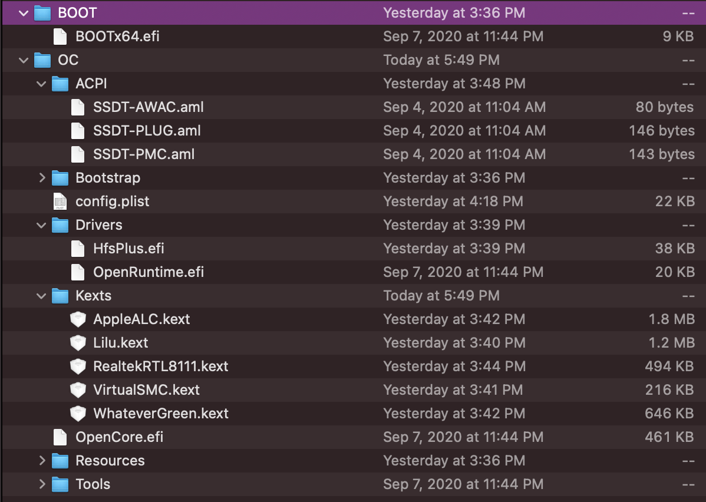

当时在公司的时候，用公司的电脑安装了一下黑苹果，感觉还不错，一方面，苹果系统在日常使用的过程中可能更舒服一些，另一方面，折腾黑苹果的过程也许会给人带来成就感，也就是在尝试很多配置之后终于正常启动的快乐。

于是也在想着给在实验室用的机器装一下黑苹果。尝试了几天，总算是回归正轨了。

## Clover

在公司的时候，了解的不太多，没有敢尝试OpenCore，于是选择了相对资源更齐全的Clover。其实也只是因为Clover提供了那种配置好的傻瓜包，从这里开始也不错。

尝试几次，了解安装的基本过程之后，还算顺利地使系统运行起来，但很尴尬的是，当时显示器只有HDMI的接口，而如果想要使用HDMI，还需要对主板上的接口进行一些hack。
如果不进行hack，就不驱动自己的显卡，然后显示效果很差。为了显示得更好一些，于是开始进行hack。
通过HackinTool，将主板上的接口进行一个映射，将HDMI的接口与DP的接口进行了一个链接。

这个过程其实比较痛苦，因为基本上是靠不断尝试每一个可能的配置，如果不正确的话，就需要进行重新启动，重新配置。
其实想想看，也许是存在一些高效的方法来尝试它，不过这就是后话了。

几天后解决了显示的问题，第一次Hack就算是成功了。

后来就是解决诸如音频，以及HiHPI之类的细节优化，效果其实还好的。

## 硬件准备

为了安装得更顺利一点，在购买硬件的时候也留意了一下有没有成功案例，其实主要也就是主板和显卡。
为了压缩预算，我没有购买独立显卡，如果需要以后再添加了。

最终我的硬件是：ASUS Prime Z390 P + i7 9700K + 16G RAM + 500G SSD + 2T HDD

## 新的安装

之前尝试Clover尝到了甜头，于是这次也是首先用了Clover，但这次因为硬盘格式转换的问题导致无法进行安装，换了几个驱动也没有成功，于是萌生了使用OpenCore的想法。当然使用OpenCore的另一个原因是我在Github上找到了一个和我一样配置的仓库，它做到了几乎完美，但这也给后来的安装过程埋下了隐患。

### OpenCore

OpenCore看起来还是挺简洁的，简单来说，OpenCore和Clover一样，都是提供了BootLoader的功能，所以我们首先准备好一个MacOS的启动盘，再加Clover的文件或是OpenCore的文件放入EFI分区即可。

最终的**OpenCore文件结构**如下：

### BIOS 出了大问题

一开始的时候，我本想将MacOS作为主力机，于是