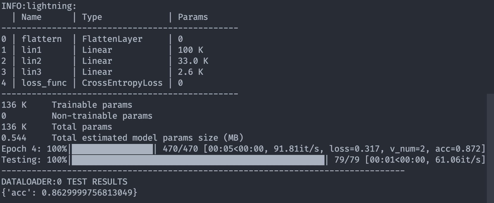
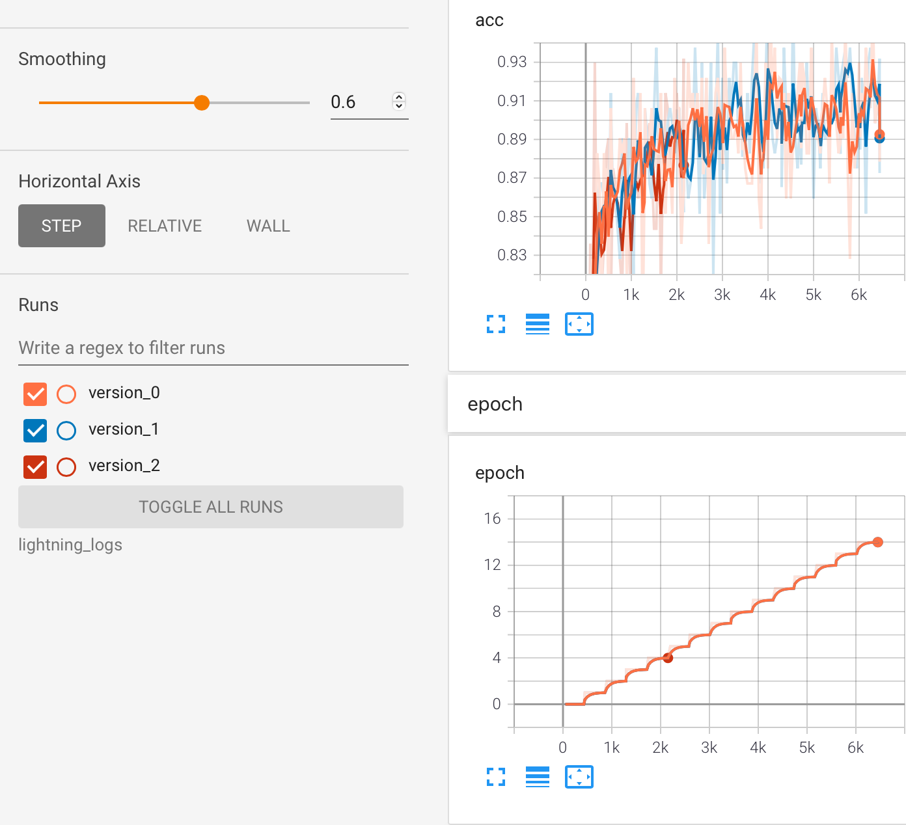

Pytorch在发展这么多年之后，虽然在不断添加新功能，但它的核心API一直是没有发生改变的。在编写代码的过程中，很容易发现有一部分代码是极其重复的，无论我们实现哪种网络模型，进行哪种计算，都必须要编写这些代码。

于是，我们也想到可以把这些重复的工程代码抽象出来，只编写那些特定于我们模型的代码，这也就诞生了**Pytorch-Lightning**。

# 什么是Pytorch-Lightning？

简而言之，Pytorch-Lightning是一个完全构建在Pytorch上的框架，它对Pytorch中除了模型构建之外的那部分代码进行了抽象和整合，让研究者可以专注于网络模型的搭建。

> Spend more time on research, less on engineering.

除了抽象出那些比较重复的代码，Pytorch-Lightning还提供了许多很有用的功能，比如：

1. 多节点，多GPU训练
2. 自动保存和读取已经训练好的权重
3. 对模型进行版本管理
4. 对训练过程进行记录
5. 对模型进行16bit量化
6. 测试模型运行的速度

如果要开发者手动实现这些功能，还是比较繁琐的，但在Pytorch-Lightning的帮助下，我们就可以在写少量代码的情况下，使用上述的功能。

如果不使用一下Pytorch-Lightning，很难体会到它带来的便利，我们接下来看一个例子。

# Pytorch识别MNIST

使用Pytorch来识别MNIST数据集是很基础的任务，直接放出代码：

```python

class Net(nn.Module):
    def __init__(self):
        super(Net, self).__init__()
        self.linear1 = nn.Linear(784, 128)
        self.linear2 = nn.Linear(128, 10)

    def forward(self, x):
        x = self.linear1(x)
        x = F.relu(x)
        x = self.linear2(x)
        output = F.log_softmax(x, dim=1)
        return output

def train(model, device, train_loader, optimizer, epoch):
    model.train()
    for batch_idx, (data, target) in enumerate(train_loader):
        data, target = data.to(device), target.to(device)
        optimizer.zero_grad()
        output = model(data)
        loss = F.nll_loss(output, target)
        loss.backward()
        optimizer.step()
        if batch_idx % 10 == 0:
            print('Train Epoch: {} [{}/{} ({:.0f}%)]\tLoss: {:.6f}'.format(
                epoch, batch_idx * len(data), len(train_loader.dataset),
                100. * batch_idx / len(train_loader), loss.item()))

if __name__ == '__main__':
    device = torch.device("cuda" if torch.cuda.is_available() else "cpu")

    dataset1 = datasets.MNIST('../data', train=True, download=True)
    dataset2 = datasets.MNIST('../data', train=False)
    train_loader = torch.utils.data.DataLoader(dataset1)
    test_loader = torch.utils.data.DataLoader(dataset2)

    model = Net().to(device)
    optimizer = optim.Adadelta(model.parameters(), lr=0.01)
    train(model, device, train_loader, optimizer, epoch)

    torch.save(model.state_dict(), "mnist_cnn.pt")

```

在这段代码中，我们首先定义了用于识别的模型`Net`，然后定义了训练的过程，在主函数中，我们首先初始化了数据集，之后便开始了训练。
可以看到，虽然只实现了这样一个简单的功能，但还是编写了不少代码，如下的代码其实完全是可以省略的。

```python
    # 训练过程中必须的代码
    optimizer.zero_grad()
    output = model(data)
    loss = F.nll_loss(output, target)
    loss.backward()
    optimizer.step()

    # 让模型运行在不同设备上
    model = Net().to(device)

    # 记录一些训练指标
    print('Train Epoch: {} [{}/{} ({:.0f}%)]\tLoss: {:.6f}'.format(
        epoch, batch_idx * len(data), len(train_loader.dataset),
        100. * batch_idx / len(train_loader), loss.item()))
```

# 使用Pytorch-Lightning来实现

使用Pytorch-Lightning其实就是将上述的代码中和模型相关的代码抽离出来，然后放到合适的位置就行了。直接放出代码：

```python 

class Net(pl.LightningModule):
    def __init__(self):
        super(Net, self).__init__()
        self.linear1 = nn.Linear(784, 128)
        self.linear2 = nn.Linear(128, 10)

    def forward(self, x):
        x = self.linear1(x)
        x = F.relu(x)
        x = self.linear2(x)
        output = F.log_softmax(x, dim=1)
        return output

    def training_step(self, batch):
        x, y = batch
        y_hat = self(x)
        loss = F.cross_entropy(y_hat, y)
        return loss

    def test_step(self, batch):
        x, y = batch
        y_hat = self(x)
        loss = F.cross_entropy(y_hat, y)
        return loss
    
    def configure_optimizers(self):
        return optim.Adadelta(self.parameters(), lr=0.01)

if __name__ == '__main__':
    dataset1 = datasets.MNIST('../data', train=True, download=True)
    dataset2 = datasets.MNIST('../data', train=False)
    train_loader = torch.utils.data.DataLoader(dataset1)
    test_loader = torch.utils.data.DataLoader(dataset2)

    model = Net()
    trainer = pl.Trainer(gpus=4)
    trainer.fit(model, train_loader)
    trainer.test(model, test_loader)

```

容易看出，在Pytorch-Lightning中，在模型中新增了几个函数，来推动整个训练过程：

1. `training_step` 用来定义模型的输出过程，该函数返回损失。
2. `test_step` 使用trainer.test()时调用。
3. `configure_optimizers` 用来定义模型用的优化器。

Pytorch-Lightning会在适当的时候，调用这些函数，以此来隐藏Pytorch中的工程代码，让开发者可以把更多的精力放在搭建复杂模型上。

初了这两个函数之外，Pytorch-Lightning中还定义了这些函数：

1. `validation_step` 与`training_step`类似，不过会在Validate的时候调用。
2. `prepare_data()` 用于准备数据。
3. `validation_epoch_end()` 在每一次Validation结束时调用。

# 使用Pytorch-Lightning的好处

在上一节中，我们并没有明确地编写是否使用GPU、如何保存模型权重、如何记录训练中的产生的指标、训练进度的可视化、训练的版本管理等等，但在使用Pytorch-Lightning之后，我们可以以很低的成本做到这些。

比如在终端里记录训练的进度以及其他指标，



又比如每次训练的结果都可以保存下来，



我在使用Pytorch-Lightning之后，感觉非常便利，可以把重心放在如何实现网络结构上，而不是如何将自己的代码工程化，一定程度上讲，简化了工作的流程。

但如同其他封装好的库，Pytorch-Lightning隐藏了很多的细节，在一开始使用的时候，会不知道如何实现一些特定的功能，需要通过查看官方文档才能明白应该怎么写，而这在以前是相对容易的。但总体而言，使用Pytorch-Lightning是利大于弊的，强烈推荐大家可以尝试使用一下。

这篇文章只是介绍了Pytorch-Lightning是什么以及它最简单的使用方法，在之后的文章里，还会介绍一些更深入的使用方法，让我们能够更好地掌控Pytorch-Lightning，实现更细粒度的功能，如果感兴趣的不妨关注一波。