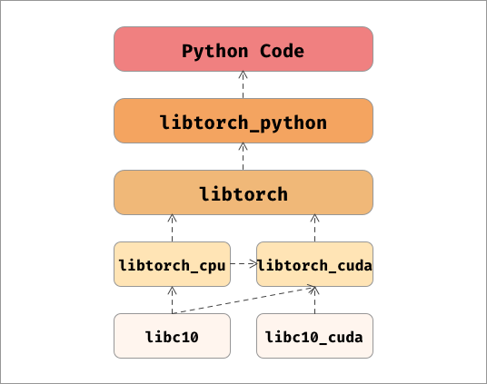

# 如何从源码编译Pytorch？

阅读Pytorch的源码的第一步，首先要获取Pytorch的源代码，然后自己构建一下Pytorch，这样可以对Pytorch有一个粗略的了解，比如Pytorch包含哪些模块，每一个模块的作用是什么，这对我们后续阅读源码会有帮助，本文假设，读者有一定的编码经验，因此不会介绍过多细节。

之前说到，本系列会从`v0.3.0`开始，一步一步阅读，这样的考虑主要是因为，从`v0.4.0`开始，Pytorch架构发生了较大的改变，从低版本开始阅读更容易把握到Pytorch的架构。

但之前也有读者提到，`v0.3.0`确实是太过于古老，接着这次重新编译Pytorch的机会，我们将源码升级到最新（截止目前，最新版本为`v1.9`），之后的阅读也会直接从`v1.9`出发，方便各位读者学习更新的内容，话不多说，我们正式开始，先做一些准备工作。

## 前期准备工作

与Pytorch官方文档中一致，我们也使用Conda来管理环境。简单介绍一下Conda，Conda可以为我们创建出若干隔离的环境，在每个环境中，我们都可以按需求安装一些库和软件，这样的隔离可以方便我们排除一些干扰。Conda还有一些好处，比如可以为环境指定Python版本，同时也可以方便地使用不同版本的Python。

首先我们使用Conda创建一个环境。

```bash
conda create -n "pytorch" PYTHON=3.6
conda activate pytorch
```

使用上面的指令，我们创建了一个名字为"pytorch"的环境，使用Python3.6，这里使用Python3.6是出于兼容性考虑。

本文使用Ubuntu18.04作为宿主机。接下来安装一些必要的库：

```bash
conda install numpy ninja pyyaml mkl mkl-include setuptools cmake cffi typing_extensions \
   future six requests dataclasses magma-cuda110 lapack -c pytorch -c conda-forge
```

Conda会在当前环境里为我们安装这些依赖，使用Windows或者MacOS的读者，需要根据官方仓库中的说明，安装对应的依赖。

## 开始编译

完成上述步骤后，我们正式开始编译，首先获取源码。

```bash
# 使用git从Github上克隆源码，注意 --recursive 是必要的，因为我们需要克隆第三方依赖库。
git clone --recursive https://github.com/pytorch/pytorch
cd pytorch
```

获取源码后，首先检查一下`third_party`文件夹中是否有文件，如果没有文件或文件不全的话，需要运行如下命令获取这些依赖：

```bash
# 更新子模块
git submodule sync
git submodule update --init --recursive
```

之后我们可以开始编译了。要确保，系统中已经安装好`cmake`，Conda中已经安装了Cmake。

```bash
# 安装torch到python的库目录
python setup.py install
# 只编译不进行安装
python setup.py develop 
```

注意在这里，我们选择`develop`作为setup的选项，这样的话，编译好的文件将不会安装到Python的目录中，这样可以避免我们自己编译的库与其他安装的库发生冲突。
正常完成编译，没有错误之后，再进行下一步。

# Pytorch编译过程解析

Pytorch混合了多种语言，主要是Python与C++，于是从源码编译要求读者对C++也有一定了解，比如知晓C++程序的编译过程。为了处理大型C++项目，Pytorch中也使用了CMake作为组织整个项目的工具，不熟悉Cmake的读者，不妨先去了解一下什么是CMake。

## Cmake 简要介绍

Cmake是一个广泛使用的构建系统生成器（Build System Generator），用来组织C++项目，然后生成一系列编译指令，交给构建系统（Build System），最终生成出一个可执行文件或是库文件。

举个简单的例子，我们想要盖一个商场，首先需要一个建筑的图纸，然后将图纸交给施工队，施工队帮我们完成商场的建设。于是我们先用Cmake这个工具，画一个蓝图出来，然后交给施工队（make，ninja）就能得到我们想要的商场，这个过程中，源代码就像是砖头和其他建材。

Cmake需要一系列`CMakeLists.txt`来发挥作用，我们就在这个文件中，编写如何生成最后的程序。每一个文件夹中会有一个`CMakeLists`，这样Cmake便可以组织起整个目录。

这里给出一个简单的cmake工程，文件目录如下：

```bash
.
├── CMakeLists.txt
├── Demo
│   └── CMakeLists.txt
└── Hello
    └── CMakeLists.txt
```

### root

```bash
cmake_minimum_required (VERSION 2.8.11)
project (HELLO)

add_subdirectory (Hello)
add_subdirectory (Demo)
```

### Hello

```bash
add_library (Hello hello.cxx)
target_include_directories (Hello PUBLIC ${CMAKE_CURRENT_SOURCE_DIR})
```

### Demo

```bash
add_executable (helloDemo demo.cxx demo_b.cxx)
target_link_libraries (helloDemo LINK_PUBLIC Hello)
```

在根目录中，我们指明工程名字是`HELLO`，在Hello文件夹中，我们生成了一个叫做`Hello`的静态库，在Demo文件夹中，我们生成一个叫做`helloDemo`的可执行文件，并与`Hello`库进行链接，然后得到最终的可执行文件。这个例子虽然简单，但几乎所有的Cmake工程，都会遵循这样的一个范式，理解这样编译的流程，对我们理解Pytorch编译很有帮助。

再次建议想要阅读源码的读者先去系统地学习一下Cmake，否则将无法了解Pytorch的构建过程。接下来，我们正式开始看一下Pytorch的整个构建过程。

## setup.py 

与其他Python库一样，在Pytorch源码的根目录下，有一个文件叫做`setup.py`，这个文件是Pytorch生成的入口文件，里面定义了Pytorch的构建过程，检查了第三方依赖库的完整性，并且声明了Pytorch的基本信息，比如名字，版本号，描述信息，作者信息等等，这些信息是每一个Python库都需要的。看一下经过简化的`main`函数：

```python
   dist = Distribution()
   # 处理命令行参数
   dist.parse_command_line()
   # 构建依赖库
   build_deps()
   # 生成拓展所需的部分
   extensions, cmdclass, packages, entry_points, install_requires = configure_extension_build()
   # 构成Python库
   setup(
      name=package_name,
      version=version,
      description=("Tensors and Dynamic neural networks in Python with strong GPU acceleration"),
      long_description=long_description,
      long_description_content_type="text/markdown",
      ext_modules=extensions,
      cmdclass=cmdclass,
      packages=packages,
      entry_points=entry_points,
      install_requires=install_requires,
      package_data={
         'torch': [
            ...
         ],
         'caffe2': [
            ...
         ],
      },
      url='https://pytorch.org/',
      download_url='https://github.com/pytorch/pytorch/tags',
      author='PyTorch Team',
      author_email='packages@pytorch.org',
      python_requires='>={}'.format(python_min_version_str),
      license='BSD-3',
      keywords='pytorch machine learning',
   )

```

### 命令行参数

这个容易理解，Pytorch里面有非常多的选项，比如是否要开启调试信息，是否要启用CUDA，是否要编译测试代码，是否要进行编译分布式的代码，都可以通过向命令行传编译选项来进行控制，而不需要对编译代码进行改动。

### 编译依赖

接下来是重头戏，这一步编译了所有我们需要的C++库，包括依赖库和Pytorch的源码。主要分为两步：

1. 检查第三方库的源码的完整性。
2. 编译依赖库，libtorch，libc10等。

还记得我们在下载pytorch源码的时候执行了`git submodule update --init --recursive`吗，这条命令帮我们下载了Pytorch的依赖库，这些库是托管在其他仓库里的，统一被下载到了`third_party`下面，在编译之前，第一步是检查一下是否所有所有的依赖库都被完整地下载好，如果有缺失，则会报错并退出。

之后便是使用Cmake对整个工程进行构建，Pytorch对Cmake进行了一个简单的封装，可以在python代码中调用Cmake，具体构建的过程我们下一节详细介绍。

### 整理Pytorch需要的拓展

还记得我们上一篇文章讲过，Pytorch以一个拓展的方式与Python代码进行耦合吗，这一部分就整理了Pytorch需要的诸多扩展，最重要的就是`_C`这个拓展：

```python
   # 声明一个Python拓展
   C = Extension("torch._C",
               libraries=["torch_python"],
               sources=["torch/csrc/stub.c"],
               language='c',
               extra_compile_args=main_compile_args + extra_compile_args,
               include_dirs=[],
               library_dirs=library_dirs,
               extra_link_args=extra_link_args + main_link_args + make_relative_rpath_args('lib'))
   extensions.append(C)
```

从上面的代码中可以看到，`_C`的源码是`torch/csrc/stub.c`，它依赖`torch_python`这个库。可以说`_C`是一个入口，真正起作用的是`torch_python`，这个我们之后细讲。

除了`_C`之外，Pytorch还需要一些拓展：

1. _dl：在Unix系统中使用动态库。
2. shm：共享内存管理的库。

生成这些拓展后，这一步还会做一些简单的事，比如生成`setup`需要用到的命令，Pytorch中的资源文件等等。

### setup

最后一步是利用Python通用的生成库的函数`setup`来最终生成Pytorch这个库。

至此我们走完了Pytorch生成的过程，下一步我们将深入依赖库的编译过程中。

## Cmake

上文提到，每一个工程，都会有一个`CMakeLists.txt`位于根目录中，cmake会将这个文件作为入口，开始编译的过程。在编译过程中，我们可以通过`add_subdirectory`这个函数来添加一个包含`CMakeLists.txt`的文件夹，cmake会进入这个文件夹，接着执行其中的`CMakeLists.txt`，这样可以形成一个树状的结构，直到运行结束所有的代码。这也是一个小技巧，我们可以通过搜索`add_subdirectory`来明确参与编译的目录。
我们先进入根目录的CMakeLists。

### root cmakelists

在这个文件中，我们做了如下这些事：

1. 声明工程名字，这是CMake必需的
2. 确认使用C++14
3. 确定使用的CPU的架构，可能是INTEL或是AARCH64
4. 列出编译的可选选项，使用setup中的命令行选项
5. 引入Utils工具，用来简化代码
6. 设置版本号
7. **编译第三方依赖库**
8. 根据不同的编译选项设置编译器的flags
9. **核心编译部分** 
10. 输出工程小结

我们需要关注7和9，在第7步中，我们利用Cmake寻找，编译好了`third_party`中的所有依赖库，在`third_party`中的每一个文件夹下，都含有一个`CMakeLists.txt`方便Cmake进行编译。

在第9步中，我们引入了其他文件夹，开始源码的编译过程。

```bash
# ---[ Main build
add_subdirectory(c10)
add_subdirectory(caffe2)
```

可以看到，我们引入了`c10`和`caffe2`两个文件夹，所以我们下一步就是进去这两个文件夹，看一下其中的编译过程。

### c10 cmakelists

`c10`是一个独立的库，是Pytorch中Tensor的抽象，一开始位于`ATen/core`，现在被抽离出来形成了单独的一个库。

为了更好地理解如何构建c10，我们给出精简过的`CMakeLists.txt`，其中省略了一些选项配置的部分。

```bash
# 声明Cmake工程
project(c10 CXX)
# 添加c10这个库
add_library(c10 ${C10_SRCS} ${C10_HEADERS})
# 为c10添加依赖库
target_link_libraries(c10 PUBLIC gflags)
target_link_libraries(c10 PUBLIC glog::glog)
# 添加c10的剩余部分
add_subdirectory(test)
add_subdirectory(benchmark)
add_subdirectory(cuda)
# 将编译好的库安装到指定位置
install(TARGETS c10 EXPORT Caffe2Targets DESTINATION lib)
install(DIRECTORY ${CMAKE_CURRENT_LIST_DIR}
        DESTINATION include
        FILES_MATCHING PATTERN "*.h")
install(FILES ${CMAKE_BINARY_DIR}/c10/macros/cmake_macros.h
        DESTINATION include/c10/macros)
```

从上述代码中可以看到，我们需要从当前文件夹中搜集c10的源文件和头文件，然后利用他们编译c10这个库，并为c10添加依赖库，然后将生成的库安装到指定位置方便后续使用。

这是一个非常典型的Cmake编译过程，后面我们还会看到类似的代码，这里的逻辑与C++编译的过程是吻合的，不熟悉C++编译过程的读者请自行补充相关知识。

### caffe cmakelists

为了不让文章过于冗长，我隐藏了很多与配置编译选项有关的代码，只保留了代码生成和库定义的代码，这些代码可以帮助我们梳理Pytorch编译的过程，帮助我们梳理Pytorch的结构，如果需要更详细的对于编译代码的分析，请读者自行阅读源码。

让我们开始最核心的，位于`caffe2`文件夹中的`CMakeLists.txt`。

首先，我们引入另一个子文件`${ROOT}/cmake/Codegen.cmake`，在这个文件中，Pytorch**动态生成**了ATen所需要的代码，这是一个很关键的点。关于ATen代码的动态生成，我们将在下一篇文章中介绍，在这里不展开讲解。

生成部分源代码之后，Pytorch选择了ATen的并行后端，可供选择的后端有：

1. NATIVE
2. OMP -> OpenMP
3. TBB

之后开始了ATen的编译，我们通过`add_subdirectory(../aten aten)`进入ATen文件夹。在这里，我们并没有直接将ATen的源代码编译为一个独立的库，而是将所有ATen的源代码收集起来，然后传递回`caffe2`中，以供后续使用。

一般来说，我们不需要用到`caffe2`，所以我们选择忽略掉大部分我们不需要的`caffe2`模块，只留下了：

```bash 
add_subdirectory(core)
add_subdirectory(serialize)
add_subdirectory(utils)
add_subdirectory(perfkernels)
add_subdirectory(proto)
```

我们之前收集的ATen源代码，会并入Cafee2的源代码，但由于我们没有包含`caffe2`模块，所以其他大部分代码还是ATen的，之后我们将ATen编译为`torch_cpu`，从这里开始真正构建`libtorch`。

```bash 
list(APPEND Caffe2_CPU_SRCS ${GENERATED_CXX_TORCH} ${GENERATED_H_TORCH})
# 创建torch_cpu库
add_library(torch_cpu ${Caffe2_CPU_SRCS})
```

之后便是一些与`c10`中类似的结构，用于生成库，并为库添加依赖，如下代码所示：

```bash
# 给 torch_cpu 添加链接库
target_link_libraries(torch_cpu PUBLIC c10)
caffe2_interface_library(torch_cpu torch_cpu_library)

# 生成 torch_cuda 库
cuda_add_library(torch_cuda ${Caffe2_GPU_SRCS} ${Caffe2_GPU_SRCS_W_SORT_BY_KEY})
target_link_libraries(torch_cuda INTERFACE torch::cudart)
target_link_libraries(torch_cuda PUBLIC c10_cuda torch::nvtoolsext)
target_link_libraries(torch_cuda PUBLIC torch_cpu_library ${Caffe2_PUBLIC_CUDA_DEPENDENCY_LIBS})
caffe2_interface_library(torch_cuda torch_cuda_library)

# 生成 torch 库
add_library(torch ${DUMMY_EMPTY_FILE}
caffe2_interface_library(torch torch_library)
target_link_libraries(torch PUBLIC torch_cpu_library)
target_link_libraries(torch PUBLIC torch_cuda_library)
```

从上面的代码中我们容易看到，`libtorch`只是一个外壳，里面包含了两个独立的库，`libtorch_cpu`和`lib_torch_cuda`，我们之后会用到的，也均是`libtorch`。同时注意到，他们都取了别名，在后续的构建中，都会使用别名来指代对应的库。

我们完成这些库的构建后，还需要编译Python绑定(python binding)，借助`add_subdirectory(../torch torch)`来进行编译。

### torch cmakelists 

直接贴上源码，这部分很容易梳理：

```bash
set(TORCH_PYTHON_SRCS
    ${GENERATED_THNN_CXX}
    ${GENERATED_CXX_PYTHON}
    )
add_library(torch_python SHARED ${TORCH_PYTHON_SRCS})
target_link_libraries(torch_python torch_library ${TORCH_PYTHON_LINK_LIBRARIES})
install(TARGETS torch_python DESTINATION "${TORCH_INSTALL_LIB_DIR}")
```

之前生成了一些代码，然后这些代码编译成了Pytorch的Python绑定。

至此，Pytorch的编译完成。

## 编译过程中到底发生了什么

Pytorch的编译过程涉及了太多与Cmake和C++相关的知识，如果对他们不熟悉的读者，理解起来可能会有些吃力。

所谓编译过程，其实就是盖房子，通过给定的图纸，一步一步建起一座大楼。
Pytorch中包含了许多C++库，编译主要就是要生成它们。每一个库都需要源代码，包含源文件和头文件，一个库还可能会依赖于其他库，这个时候就需要进行链接，最终形成一个库，这就是我们在上文中做的事情，不断寻找源文件，编译成库，再将这些库按需要链接在一起。

## 从中梳理Pytorch的结构

Pytorch就是这样一个库，一个混杂着python，c++和c的库，但每个部分都各司其职，井然有序，我们用一张图来对它的架构进行表示。



我们也可以使用`ld`命令得到类似的结果，如下：

```bash
_C.cpython-36m-x86_64-linux-gnu.so => ../pytorch/torch/_C.cpython-36m-x86_64-linux-gnu.so (interpreter => none)
   libtorch_python.so => ../pytorch/torch/lib/libtorch_python.so
      libshm.so => ../pytorch/torch/lib/libshm.so
      libtorch.so => ../pytorch/torch/lib/libtorch.so
      libtorch_cpu.so => ../pytorch/torch/lib/libtorch_cpu.so
      libtorch_cuda.so => ../pytorch/torch/lib/libtorch_cuda.so
      libc10_cuda.so => ../pytorch/torch/lib/libc10_cuda.so
      libc10.so => ../pytorch/torch/lib/libc10.so
```

我们再回顾一下Pytorch中几个大的模块：

1. c10：Tensor的核心抽象，从ATen/core中抽离出来。
2. ATen：Pytorch与Caffe2公用的计算后端。
3. Caffe2：另一个深度学习框架，源于Caffe。
4. Torch：Pytorch的源码，包含python与c++，c++部分位于`csrc`文件夹中。

所以现在出现了两个方向，如果想了解具体的计算部分，可以查看`c10`和`ATen`，如果想了解Pytorch内部的代码逻辑，比如自动微分以及模型推理，可以查看`Torch`。当然我们这个系列两个方向都会深入下去。

## 结语

相信各位读者现在已经明白了Pytorch的整体架构，理解架构对我们阅读源码是很有帮助的一件事。

这篇文章比较长，里面也包含了较多代码上的细节，如果想要了解更详细的内容，需要读者亲自深入源码。**同时也欢迎对文章有疑惑，有意见，有建议的读者与我们一同交流。**

下一篇文章，我们将深入ATen的源码生成部分。

